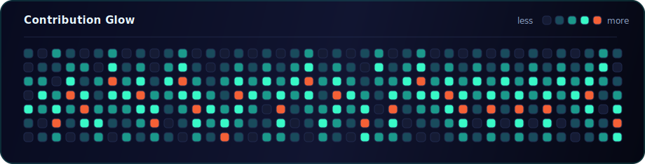

<div align="center">


<a href="https://www.linkedin.com/in/alina-liaquat-779347325/">
  
</a>


<br />
<br />


</div>

## About Me

I am a Computer Science student building practical AI, machine learning, and data-driven applications. My work usually sits at the intersection of model development, backend APIs, interactive dashboards and deployment-ready product thinking.

I like turning real-world problems into working systems: crop disease detection for farmers, forest fire risk analysis, clinical safety tools, health prediction apps, and interactive ML products.

<div align="center">


</div>

## Featured Projects

<table>
  <tr>
    <td width="50%" valign="top">
      <h3>Bazgar AI</h3>
      <p><b>Apple Disease Detection and Smart Farming Assistant</b></p>
      <p>Full-stack AI application for Balochi farmers with real-time apple leaf disease diagnostics, localized treatment suggestions, Balochi voice guidance, and an adaptive UCB1 reinforcement learning crop assistant.</p>
      <p>
        
        
        
        
      </p>
    </td>
    <td width="50%" valign="top">
      <h3>EcoSafe AI</h3>
      <p><b>Forest Fire Detection and Intelligent Risk Analysis</b></p>
      <p>Offline-first Android application with dynamic risk mapping, local incident tracking, CameraX image capture, and FastAPI-powered TensorFlow Lite fire classification.</p>
      <p>
        
        
        
        
      </p>
    </td>
  </tr>
  <tr>
    <td width="50%" valign="top">
      <h3>ThyroAssess AI</h3>
      <p><b>Thyroid Cancer Risk Assessment Web App</b></p>
      <p>Machine learning web application trained on 200K+ patient records with EDA, Logistic Regression modeling, FastAPI integration, MongoDB storage, and a responsive Vercel-deployed interface.</p>
      <p>
        
        
        
        
      </p>
    </td>
    <td width="50%" valign="top">
      <h3>MediNomix</h3>
      <p><b>Medication Error Prevention System</b></p>
      <p>Clinical database application for reducing Look-Alike/Sound-Alike medication errors using phonetic similarity matching, OpenFDA ETL workflows, Streamlit views, and Neon PostgreSQL.</p>
      <p>
        
        
        
        
      </p>
    </td>
  </tr>
  <tr>
    <td width="50%" valign="top">
      <h3>Prosperous Farmer</h3>
      <p><b>Agriculture Data Web Application</b></p>
      <p>Bilingual Urdu-English dashboard for crop tracking, CRUD data entry, automated CSV exports, and interactive crop yield analytics using Pandas and Plotly.</p>
      <p>
        
        
        
        
      </p>
    </td>
    <td width="50%" valign="top">
      <h3>Dakati Game</h3>
      <p><b>Dacoit-Themed Social Deduction Game</b></p>
      <p>Cross-platform game with a responsive Kivy GUI, trigonometry-based circular player layout, optimized role allocation, voting logic, and Android packaging through Buildozer.</p>
      <p>
        
        
        
        
      </p>
    </td>
  </tr>
</table>

## More Builds

| Project | What it does | Stack |
| --- | --- | --- |
| **US Natural Resources Revenue EDA** | Cleaned, transformed, and explored monthly revenue datasets; built visual dashboards to uncover revenue trends and distribution patterns. | NumPy, Pandas, Seaborn, Matplotlib |
| **Arduino Voice and Bluetooth Robot Car** | Arduino-based robot car that responds to voice and Bluetooth commands in real time with programmable movement and response behavior. | Arduino, C, Bluetooth, Voice Recognition |

## Tech Toolbox

<div align="center">


</div>

```python
class AlinaLiaquat:
    focus = ["Machine Learning", "Deep Learning", "NLP", "AI Applications", "Full-Stack Projects"]
    current_stack = ["Python", "FastAPI", "TensorFlow Lite", "Scikit-learn", "Streamlit"]
    build_style = "turn models, data, and interfaces into useful real-world systems"
```

## GitHub Snapshot

<div align="center">



</div>

## Currently Building Around

<p align="center">
  
  
  
  
</p>

<p align="center">
  
</p>

<div align="center">


</div>
