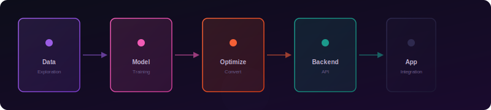

<div align="center">

<a href="https://git.io/typing-svg"></a>



<a href="https://www.linkedin.com/in/alina-liaquat-779347325/">
  
</a>
<a href="https://github.com/alinaliaquat">
  
</a>


<br />
<br />


</div>

---

## About Me

I am a Computer Science student with a deep focus on building custom machine learning models and turning them into real-world applications. My work bridges the gap between model development, backend APIs, and interactive interfaces, creating deployable, product-ready solutions.

I approach problems by asking: *"How can I build a practical, data-driven system to solve this?"* This has led me to develop projects ranging from real-time disease diagnostics and forest fire risk analysis to clinical safety tools and health prediction applications.

<div align="center">


</div>

*Also experienced with: Java, C, C++ (academic and project-based work)*

---

## AI & Machine Learning Focus

My primary focus is on the full lifecycle of ML projects: from data exploration and cleaning, to training custom models, to deploying them as accessible applications.

<div align="center">



</div>

---

## Featured Projects

### Custom ML Models & Applications

<table>
  <tr>
    <td width="50%" valign="top">

#### Bazgar AI
**Apple Disease Detection & Smart Farming Assistant**

A full-stack, culturally-tailored web application for Balochi farmers. Features a custom TensorFlow Lite classification model for real-time leaf disease diagnosis, paired with a UCB1 reinforcement learning crop assistant for adaptive, localized treatment suggestions.


</td>
    <td width="50%" valign="top">

#### EcoSafe AI
**Forest Fire Detection & Intelligent Risk Analysis**

An offline-first Android application utilizing a FastAPI backend and a TensorFlow Lite model for binary fire classification. Features dynamic Google Maps risk mapping and local SQLite incident tracking.


</td>
  </tr>
  <tr>
    <td width="50%" valign="top">

#### ThyroAssess AI
**Thyroid Cancer Risk Assessment Web App**

Developed a Logistic Regression model on 200K+ patient records to achieve 83% diagnosis accuracy. The model is integrated into a web application with a FastAPI backend, MongoDB storage, and a responsive, Vercel-deployed interface.


</td>
    <td width="50%" valign="top">

#### MediNomix
**Medication Error Prevention System**

A clinical database application to prevent Look-Alike/Sound-Alike (LASA) medication errors using phonetic similarity matching. Built with a Streamlit frontend, PostgreSQL (Neon) database, and an ETL pipeline leveraging the OpenFDA API.


</td>
  </tr>
  <tr>
    <td width="50%" valign="top">

#### Prosperous Farmer
**Bilingual Agriculture Data Dashboard**

An interactive data web app for Pakistani farmers. Features a bilingual (Urdu-English) interface, CRUD data entry, automated CSV exports, and dynamic crop yield visualizations built with Pandas and Plotly.


</td>
    <td width="50%" valign="top">

#### US Natural Resources EDA
**Comprehensive Revenue Data Analysis**

Performed in-depth data cleaning, transformation, and exploratory analysis on US monthly natural resources revenue datasets. Developed insightful dashboards using Seaborn and Matplotlib to visualize revenue trends.


</td>
  </tr>
</table>

---

## More Builds

This section highlights other projects that demonstrate my versatility across different domains.

<table>
  <tr>
    <td width="33%" valign="top">

#### Dakati Game
Cross-platform dacoit-themed social deduction game built with Python and Kivy, featuring a circular player layout and Android packaging with Buildozer.


</td>
    <td width="33%" valign="top">

#### Arduino Voice Robot Car
Hardware project programmed in C to process voice and Bluetooth commands for real-time robot car control and interaction.


</td>
  </tr>
</table>

---

## Tech Toolbox

<div align="center">

| Category | Technologies |
| :--- | :--- |
| **Primary Languages** | Python |
| **ML & Data Science** | TensorFlow, TensorFlow Lite, Scikit-learn, Pandas, NumPy, Seaborn, Matplotlib, Plotly |
| **Backend & Web** | FastAPI, Streamlit |
| **Databases** | PostgreSQL, MongoDB, MySQL, SQLite |
| **Tools & Platforms** | Git, Android Studio, Buildozer, Vercel, Netlify, Railway |
| **Core Concepts** | EDA, Classification, Regression, ETL, Model Optimization, Deployment |
| **Supplementary** | Java, C, C++ (academic and project experience) |

</div>

```python
class AlinaLiaquat:
    focus = ["Custom ML Models", "Deep Learning", "NLP", "Full-Stack AI Apps", "Model Deployment"]
    current_stack = ["Python", "TensorFlow", "Scikit-learn", "FastAPI", "Streamlit"]
    philosophy = "Build custom models that solve real-world problems, from data to deployment."
```

---

## GitHub Analytics

<div align="center">

<a href="https://github.com/precious-05">
  
</a>
<a href="https://github.com/precious-05">
  
</a>

<br />
<br />

<a href="https://github.com/precious-05">
  
</a>

</div>

---

## Connect

I am always open to collaborating on ML/AI projects or discussing new ideas.

- LinkedIn: [Alina Liaquat](https://www.linkedin.com/in/alina-liaquat-779347325/)
- GitHub: [alinaliaquat](https://github.com/alinaliaquat)

<div align="center">


</div>
